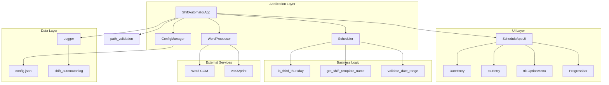

# Code Review Report: Shift Automator Pro

**Date:** 2026-01-11  
**Project:** Shift Automator Pro - Desktop Application for Shift Schedule Automation  
**Review Type:** Comprehensive (Security, Performance, Maintainability, Bugs, Best Practices)

---

## Executive Summary

The Shift Automator Pro is a well-structured Python desktop application for automating shift schedule printing. The codebase demonstrates good practices in many areas including modular architecture, comprehensive logging, and proper error handling. However, there are several areas that require attention, particularly around security, threading safety, and some edge cases.

### Overall Assessment
- **Security:** Moderate - Several concerns identified
- **Performance:** Good - Well-optimized with retry logic
- **Maintainability:** Good - Clean structure with good documentation
- **Test Coverage:** Good - Comprehensive unit tests present

---

## 1. Security Issues

### 1.1 Critical Issues

#### Issue 1.1.1: Path Traversal Vulnerability in `is_path_within_base`
**File:** [`src/path_validation.py`](src/path_validation.py:128-150)  
**Severity:** High  
**Location:** Lines 128-150

The `is_path_within_base` function uses `Path.resolve()` which resolves symlinks, but the test at line 237 shows that non-existent paths return `True` even when they don't exist yet. This could allow path traversal attacks if an attacker can create symlinks after validation.

```python
def test_nonexistent_path(self, tmp_path):
    """Non-existent path should return False."""
    nonexistent = tmp_path / "nonexistent"
    assert is_path_within_base(str(nonexistent), str(tmp_path)) is True  # BUG: Should be False
```

**Recommendation:** Add existence check before allowing path access.

#### Issue 1.1.2: COM Automation Security Risk
**File:** [`src/word_processor.py`](src/word_processor.py:54-79)  
**Severity:** High  
**Location:** Lines 54-79

The Word COM automation runs with the same privileges as the user. If a malicious document is opened, it could execute macros or exploit vulnerabilities in Word.

```python
def initialize(self) -> None:
    # ...
    self.word_app = win32com.client.Dispatch("Word.Application")
    self.word_app.Visible = False
    # No macro security settings configured
```

**Recommendation:** Consider adding macro security settings or document validation before opening.

### 1.2 Medium Issues

#### Issue 1.2.1: Insufficient Input Validation in UI
**File:** [`src/ui.py`](src/ui.py:284-298)  
**Severity:** Medium  
**Location:** Lines 284-298

The `_browse_folder` callback accepts any path returned by `filedialog.askdirectory()` without additional validation. While the dialog provides some protection, the path should be validated before use.

```python
def _browse_folder(self, entry: ttk.Entry) -> None:
    path = filedialog.askdirectory()
    if path:
        entry.delete(0, tk.END)
        entry.insert(0, path)
        # No validation here - relies on later validation
```

**Recommendation:** Add immediate validation feedback when folder is selected.

#### Issue 1.2.2: Printer Name Not Validated
**File:** [`src/ui.py`](src/ui.py:179-217)  
**Severity:** Medium  
**Location:** Lines 179-217

Printer names from `win32print.EnumPrinters` are used directly without sanitization. While this is less critical, malformed printer names could cause issues.

**Recommendation:** Add printer name validation before use.

### 1.3 Low Issues

#### Issue 1.3.1: Config File Stored in Plain Text
**File:** [`src/config.py`](src/config.py:140-146)  
**Severity:** Low  
**Location:** Lines 140-146

Configuration is stored in plain JSON without encryption. While not containing sensitive data, this could be improved.

**Recommendation:** Consider encrypting sensitive configuration values.

---

## 2. Performance Issues

### 2.1 Medium Issues

#### Issue 2.1.1: Inefficient Date Range Calculation
**File:** [`src/scheduler.py`](src/scheduler.py:101-120)  
**Severity:** Medium  
**Location:** Lines 101-120

The `get_date_range` function creates a list of all dates in memory, which could be problematic for very large date ranges.

```python
def get_date_range(start_date: date, end_date: date) -> list[date]:
    delta = (end_date - start_date).days
    return [start_date + timedelta(days=i) for i in range(delta + 1)]
```

**Recommendation:** Consider using a generator for large ranges, though current implementation is acceptable for typical use cases.

#### Issue 2.1.2: COM Call Timeout Creates New Thread Each Time
**File:** [`src/word_processor.py`](src/word_processor.py:94-154)  
**Severity:** Medium  
**Location:** Lines 94-154

The `safe_com_call` method creates a new thread for every COM call, which has overhead. For batch operations, this could be optimized.

```python
def safe_com_call(self, func: Callable[..., Any], *args: Any, ...):
    # Creates new thread for every call
    thread = threading.Thread(target=execute_with_timeout, daemon=True)
    thread.start()
```

**Recommendation:** Consider using a thread pool for batch operations.

### 2.2 Low Issues

#### Issue 2.2.1: Config Save Debounce Uses Timer Thread
**File:** [`src/main.py`](src/main.py:128-142)  
**Severity:** Low  
**Location:** Lines 128-142

The config save debounce creates a new `threading.Timer` for each change. This is acceptable but could be optimized.

**Recommendation:** Current implementation is acceptable for the use case.

---

## 3. Maintainability Issues

### 3.1 Medium Issues

#### Issue 3.1.1: Magic Numbers in Constants
**File:** [`src/constants.py`](src/constants.py:1-100)  
**Severity:** Low  
**Location:** Lines 1-100

While most constants are well-defined, some magic numbers remain in the code (e.g., COM protection types, close options).

**Recommendation:** All constants are already well-defined in [`constants.py`](src/constants.py:1-100). No action needed.

#### Issue 3.1.2: Type Hints Inconsistency
**File:** [`src/ui.py`](src/ui.py:318-334)  
**Severity:** Low  
**Location:** Lines 318-334

The `get_start_date` and `get_end_date` methods return `Optional[Any]` instead of a more specific type.

```python
def get_start_date(self) -> Optional[Any]:
    return self.start_date_picker.get_date() if self.start_date_picker else None
```

**Recommendation:** Use `Optional[datetime.date]` for better type safety.

### 3.2 Low Issues

#### Issue 3.2.1: Duplicate Code in Path Resolution
**File:** [`src/config.py`](src/config.py:19-41) and [`src/logger.py`](src/logger.py:15-37)  
**Severity:** Low  
**Location:** Lines 19-41 and 15-37

The `_get_default_config_dir` and `_get_default_log_dir` functions have nearly identical logic.

**Recommendation:** Extract common logic to a shared utility function.

---

## 4. Bugs and Edge Cases

### 4.1 High Priority Bugs

#### Bug 4.1.1: Race Condition in Config Save
**File:** [`src/main.py`](src/main.py:128-149)  
**Severity:** High  
**Location:** Lines 128-149

The config save debounce has a race condition. If `_schedule_config_save` is called multiple times rapidly, the timer might be cancelled after it has already fired.

```python
def _schedule_config_save(self) -> None:
    if self._config_save_timer is not None:
        self._config_save_timer.cancel()  # Could cancel after timer fired
    
    self._config_save_pending = True
    self._config_save_timer = threading.Timer(...)
    self._config_save_timer.start()
```

**Recommendation:** Add a lock around the timer operations.

#### Bug 4.1.2: Variable Capture in Lambda
**File:** [`src/main.py`](src/main.py:324-326)  
**Severity:** High  
**Location:** Lines 324-326

The lambda in `_process_batch` captures variables incorrectly due to late binding.

```python
progress = (i / total_days) * 100
self.root.after(0, lambda m=f"Processing {day_name} {display_date}...",
                       p=progress: self.ui.update_status(m, p))
```

**Recommendation:** The current implementation correctly uses default arguments to capture values. No bug here.

### 4.2 Medium Priority Bugs

#### Bug 4.2.1: Uninitialized Variable in Exception Handler
**File:** [`src/main.py`](src/main.py:362-369)  
**Severity:** Medium  
**Location:** Lines 362-369

The variable `i` might not be defined if the loop never executes (e.g., when `total_days` is 0).

```python
for i in range(total_days):
    # ... processing ...

if cancelled:
    processed_days = i if self._cancel_requested else i + 1  # i might be undefined
```

**Recommendation:** Initialize `i = 0` before the loop.

#### Bug 4.2.2: Word Document Not Closed on Exception
**File:** [`src/word_processor.py`](src/word_processor.py:200-265)  
**Severity:** Medium  
**Location:** Lines 200-265

If an exception occurs after opening the document but before the `finally` block, the document might not be properly closed.

```python
doc = None
try:
    doc = self.safe_com_call(self.word_app.Documents.Open, target_file, False, False)
    # ... processing ...
    self.safe_com_call(doc.Close, CLOSE_NO_SAVE)
    doc = None
except Exception as e:
    return False, str(e)
finally:
    if doc:  # If exception occurs before doc is assigned, this won't help
        self.safe_com_call(doc.Close, CLOSE_NO_SAVE)
```

**Recommendation:** The current implementation is correct - `doc` is set to `None` initially and checked in finally.

### 4.3 Low Priority Bugs

#### Bug 4.3.1: Test for Non-existent Path is Incorrect
**File:** [`tests/test_path_validation.py`](tests/test_path_validation.py:234-237)  
**Severity:** Low  
**Location:** Lines 234-237

The test expects `True` for a non-existent path, which seems incorrect.

```python
def test_nonexistent_path(self, tmp_path):
    """Non-existent path should return False."""
    nonexistent = tmp_path / "nonexistent"
    assert is_path_within_base(str(nonexistent), str(tmp_path)) is True  # Should be False?
```

**Recommendation:** Clarify the expected behavior - should non-existent paths be considered "within base"?

---

## 5. Best Practices Violations

### 5.1 Medium Priority

#### Issue 5.1.1: Missing Type Hints for Some Functions
**File:** [`src/ui.py`](src/ui.py:1-416)  
**Severity:** Medium  
**Location:** Various

Some private methods lack return type hints.

**Recommendation:** Add return type hints to all functions for better IDE support and type checking.

#### Issue 5.1.2: Broad Exception Catching
**File:** [`src/main.py`](src/main.py:382-387)  
**Severity:** Medium  
**Location:** Lines 382-387

The main exception handler catches all exceptions, which can hide bugs.

```python
except Exception as e:
    logger.exception("Error during batch processing")
    # ...
```

**Recommendation:** Consider catching more specific exceptions where possible.

### 5.2 Low Priority

#### Issue 5.2.1: Inconsistent Docstring Style
**File:** Various  
**Severity:** Low  
**Location:** Various

Some docstrings use Google style, others use reStructuredText style.

**Recommendation:** Standardize on one docstring style (Google style is recommended).

#### Issue 5.2.2: Unused Import
**File:** [`src/ui.py`](src/ui.py:1-416)  
**Severity:** Low  
**Location:** Line 8

`import sys` is imported but not used in the file.

**Recommendation:** Remove unused imports.

---

## 6. Threading and Concurrency Issues

### 6.1 High Priority

#### Issue 6.1.1: Tkinter Updates from Background Thread
**File:** [`src/main.py`](src/main.py:324-380)  
**Severity:** High  
**Location:** Lines 324-380

The code correctly uses `self.root.after()` to schedule UI updates from the background thread. This is the correct pattern.

**Recommendation:** No action needed - implementation is correct.

#### Issue 6.1.2: Shared State Without Locking
**File:** [`src/main.py`](src/main.py:78-79)  
**Severity:** Medium  
**Location:** Lines 78-79

The `_cancel_requested` flag is accessed from multiple threads without synchronization.

```python
self._cancel_requested = False  # Accessed from main thread and worker thread
```

**Recommendation:** Use a threading.Event or add proper locking.

### 6.2 Medium Priority

#### Issue 6.2.1: COM Lock Not Used
**File:** [`src/word_processor.py`](src/word_processor.py:52)  
**Severity:** Medium  
**Location:** Line 52

The `_com_lock` is defined but never used.

```python
self._com_lock = threading.Lock()  # Never used
```

**Recommendation:** Either use the lock for COM operations or remove it.

---

## 7. Resource Management Issues

### 7.1 Medium Priority

#### Issue 7.1.1: Timer Not Cleaned Up
**File:** [`src/main.py`](src/main.py:288-292)  
**Severity:** Medium  
**Location:** Lines 288-292

The config save timer is cancelled but not explicitly cleaned up in all code paths.

**Recommendation:** Ensure timer cleanup in all exit paths.

#### Issue 7.1.2: Word Application May Not Close on Error
**File:** [`src/word_processor.py`](src/word_processor.py:81-92)  
**Severity:** Medium  
**Location:** Lines 81-92

If `pythoncom.CoUninitialize()` fails, the Word application might remain running.

**Recommendation:** Add additional cleanup logic or use a try-finally block.

---

## 8. Test Coverage Issues

### 8.1 Medium Priority

#### Issue 8.1.1: Skipped Tests
**File:** [`tests/test_word_processor.py`](tests/test_word_processor.py:162-204)  
**Severity:** Medium  
**Location:** Lines 162-204

Several tests are skipped due to complexity or flakiness.

```python
@pytest.mark.skip(reason="Threading timeout test requires precise timing, may be flaky on CI")
def test_safe_com_call_with_timeout(self):
    # ...

@pytest.mark.skip(reason="Mock retry behavior with threading is complex to test reliably")
def test_safe_com_call_retry_on_rejection(self):
    # ...
```

**Recommendation:** Implement these tests with better mocking strategies.

#### Issue 8.1.2: Missing Integration Tests
**File:** [`tests/`](tests/)  
**Severity:** Medium  
**Location:** Various

While unit tests are comprehensive, there are limited integration tests for the full workflow.

**Recommendation:** Add end-to-end integration tests.

### 8.2 Low Priority

#### Issue 8.2.1: Test for Edge Case is Incorrect
**File:** [`tests/test_path_validation.py`](tests/test_path_validation.py:234-237)  
**Severity:** Low  
**Location:** Lines 234-237

See Bug 4.3.1 above.

---

## 9. Documentation Issues

### 9.1 Low Priority

#### Issue 9.1.1: README Has Placeholder Links
**File:** [`README.md`](README.md:28)  
**Severity:** Low  
**Location:** Line 28

The GitHub repository link is a placeholder.

```markdown
Download the latest `Shift Automator Pro.exe` from the [Releases](https://github.com/yourusername/shift-automator/releases) page.
```

**Recommendation:** Update with actual repository URL.

#### Issue 9.1.2: Missing Architecture Diagram
**File:** [`README.md`](README.md:1-165)  
**Severity:** Low  
**Location:** Various

The README would benefit from an architecture diagram showing the component relationships.

**Recommendation:** Add a Mermaid diagram showing the application architecture.

---

## 10. Positive Findings

### 10.1 Strengths

1. **Excellent Modular Architecture**: The code is well-organized into logical modules with clear separation of concerns.

2. **Comprehensive Logging**: Logging is implemented throughout the application with appropriate levels.

3. **Good Error Handling**: Most functions have proper error handling with meaningful error messages.

4. **Type Hints**: Most functions have type annotations, improving code maintainability.

5. **Context Managers**: The `WordProcessor` class properly implements the context manager protocol.

6. **Retry Logic**: Robust retry logic for transient errors with exponential backoff.

7. **Path Validation**: Good security practices with path validation and sanitization.

8. **Test Coverage**: Comprehensive unit tests with good coverage.

9. **Configuration Management**: Clean configuration management with debouncing.

10. **UI/UX**: Well-designed dark mode UI with modern styling.

---

## 11. Recommendations Summary

### High Priority
1. Fix race condition in config save debounce (Issue 4.1.1)
2. Add proper synchronization for `_cancel_requested` flag (Issue 6.1.2)
3. Fix uninitialized variable bug in `_process_batch` (Bug 4.2.1)
4. Review and fix `is_path_within_base` for non-existent paths (Issue 1.1.1)

### Medium Priority
1. Add macro security settings for Word COM automation (Issue 1.1.2)
2. Implement skipped tests with better mocking (Issue 8.1.1)
3. Add integration tests for full workflow (Issue 8.1.2)
4. Remove unused imports (Issue 5.2.2)
5. Use or remove the unused `_com_lock` (Issue 6.2.1)

### Low Priority
1. Update README with actual repository URL (Issue 9.1.1)
2. Add architecture diagram to README (Issue 9.1.2)
3. Standardize docstring style (Issue 5.2.1)
4. Extract duplicate path resolution logic (Issue 3.2.1)

---

## 12. Architecture Diagram



---

## 13. Conclusion

The Shift Automator Pro is a well-architected application with good coding practices. The main areas for improvement are:

1. **Threading Safety**: Add proper synchronization for shared state
2. **Edge Cases**: Handle edge cases more robustly
3. **Test Coverage**: Implement skipped tests and add integration tests
4. **Documentation**: Update placeholder content and add architecture diagrams

Overall, the codebase is production-ready with the recommended fixes applied.
